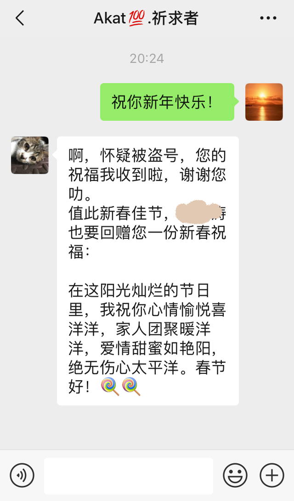

# Wish Reply Bot

2019年猪年，过年微信自动发送祝福和回复祝福的小机器人🤖️。

## 使用

```bash
git clone git@github.com:AkatQuas/wish-reply-bot.git

cd  wish-reply-bot

pip3 install -r requirements.txt
```

## 说明

请谨慎使用，封号什么的咱不知道。

使用前建议先看看代码。只有两个比较重要的文件。

1. 挨（群）个（发）祝福：[auto_send_wish](auto_send_wish.py)

1. 秒回祝福：[auto_reply_wish](auto_reply_wish.py)

底层机器人来源为 [itchat](https://itchat.readthedocs.io/zh/latest/)。

## 运行

给好友挨个单独发送祝福。

```bash
python3 auto_send_wish.py
```

针对好友的祝福，进行秒回。

```bash
python3 auto_reply_wish.py
```

祝福语的自动拼凑在`wish_txt.py`中的`randomWish`中实现，因为加了emoji，使得祝福变得活泼了点。不喜欢祝福语的话，可以自行替换哦。

## 效果



## 🐷大家春节快乐！
